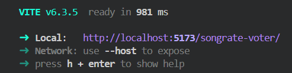
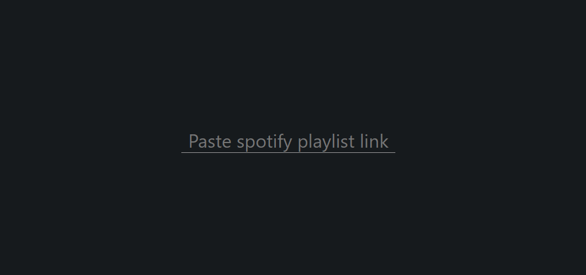
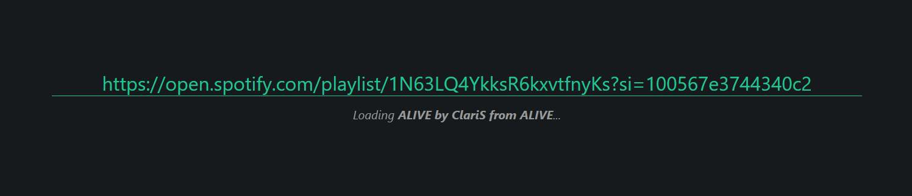
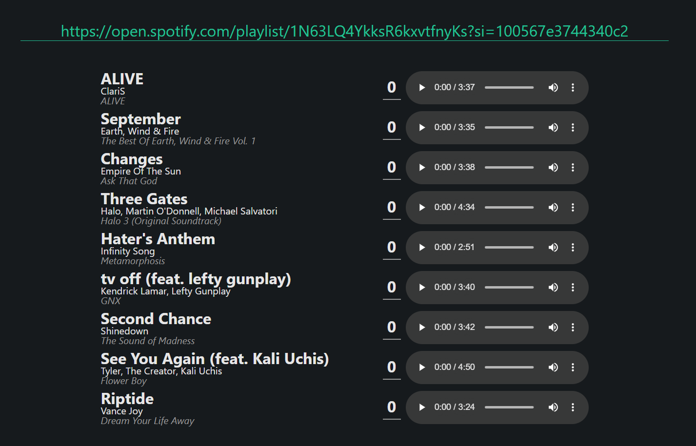
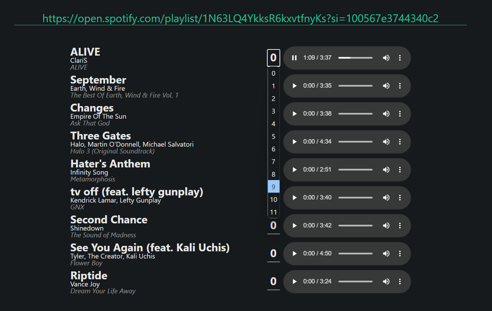

# Song Downloader and Rating System

## Overview

This project is a proof of concept web application that allows users to preview and rate songs from a Spotify playlist all in one place for convenience. The project consists of a local backend server built with Flask and a React frontend. It uses the Spotify API to extract song details and the yt_dlp library to download audio files from YouTube.

## Features

* Dynamic input field for pasting Spotify playlist links
* Loading indicator for downloading songs
* Download songs from YouTube using the `yt_dlp` library
* Rate songs from 0 to 11
* User-friendly interface built with React

## Setup

### Prerequisites

* Node.js (14.x or higher)
* Python (3.8.x or higher)
* Flask (2.x or higher)
* yt_dlp (2021.x or higher)
* Spotify API credentials (Client ID and Client Secret)

### Backend Setup

* Clone the repository: `git clone https://github.com/alexcarron/songrate-voter.git`
* Install dependencies:
  * Install frontend dependencies:
    * Navigate to the repository directory: `cd songrate-voter`
    * Install dependencies: `npm install`
  * Install backend dependencies:
    * Navigate to the backend directory: `cd server`
    * Install dependencies: `pip install -r requirements.txt`

* Create a `.env` file with your Spotify API credentials:
  * `VITE_CLIENT_ID="your-client-id"`
  * `VITE_CLIENT_SECRET="your-client-secret"`

* Start the development server:
  * `npm run start` (for frontend)
  * `python server/index.py` (for backend)
    * Altneratively, if you prefer using Flask's built-in server, use `flask run --app server/index.py`

## Usage

### 1. Open webpage

Open the URL shown in the terminal after running the Vite server.

You will be greeted with an empty input field

### 2. Paste a link

Paste a Spotify playlist link into the input field

### 3. Wait

Wait for the songs to finish downloading once the loading indicator vanishes

### 4. Listen & Rate!

Listen to the displayed songs and select your ratings for them

## Technical Details

* **Frontend**: React, TypeScript, CSS
* **Backend**: Flask, Python, yt_dlp
* **Spotify API**: Used to extract song details from playlists
* **Vite**: Used as a development server and build tool
